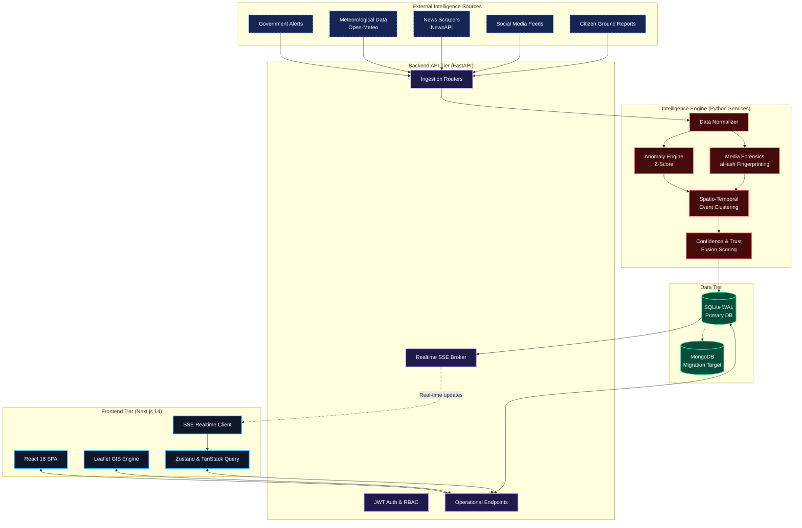

# MausamNet System Architecture

MausamNet is designed as a highly decoupled, multi-tier intelligence platform. It separates the raw data ingestion layer from the AI processing engine and the final human-in-the-loop verification workflow.

## High-Level Architecture Diagram

## Component Breakdown

### 1. External Data Sources
MausamNet utilizes connector interfaces to ingest heterogeneous weather intelligence. 
- **Active Real APIs**: Integrates with Open-Meteo for live meteorological data and NewsAPI for local event reporting.
- **Pluggable Connectors**: Designed so government APIs (e.g., IMD) or social scraping pipelines can be easily plugged into the standard `Signal` model.

### 2. Frontend Tier (Next.js 14)
- **Command Center UI**: A dark-mode, GIS-heavy React application built with Tailwind CSS.
- **Progressive Disclosure Map**: Built on Leaflet, it handles rendering thousands of markers, heatmaps, and dynamic risk zones via GeoJSON.
- **Real-Time State**: Uses TanStack Query for caching and an SSE (Server-Sent Events) listener to instantly reflect new emergencies without browser polling.

### 3. Backend API (FastAPI)
- **High-Performance Routers**: Asynchronous Pydantic-validated endpoints handling thousands of signals.
- **RBAC (Role-Based Access Control)**: Strict JWT enforcement separating `ANALYST` (investigation) from `VERIFIER` (approval).
- **SSE Broker**: Streams event state changes and alert notifications to active connected clients.

### 4. Intelligence Engine (The AI Layer)
This is where raw signals become actionable events.
- **Anomaly Engine**: Calculates Z-scores against local baselines to flag statistically unusual observations.
- **Media Forensics**: Uses perceptual hashing (aHash) to check uploaded disaster imagery against a historical corpus to detect recycled media.
- **Spatio-Temporal Clustering**: Groups related signals occurring near each other in space and time into a unified "Event".
- **Fusion Scoring**: Computes AI Confidence (analytical probability) and Trust Score (source reliability).

### 5. Data Tier
- **Current**: SQLite in WAL (Write-Ahead Logging) mode, fully capable of handling the prototype's high read/write concurrency.
- **Future-Ready**: Built using the Repository Pattern. The services don't know they are talking to SQLite. The codebase includes documentation (`MONGODB_MIGRATION.md`) detailing how to swap the repository implementation to MongoDB for horizontal scaling without changing a single line of business logic.
